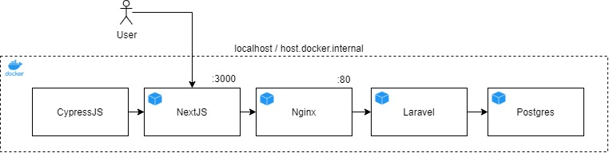
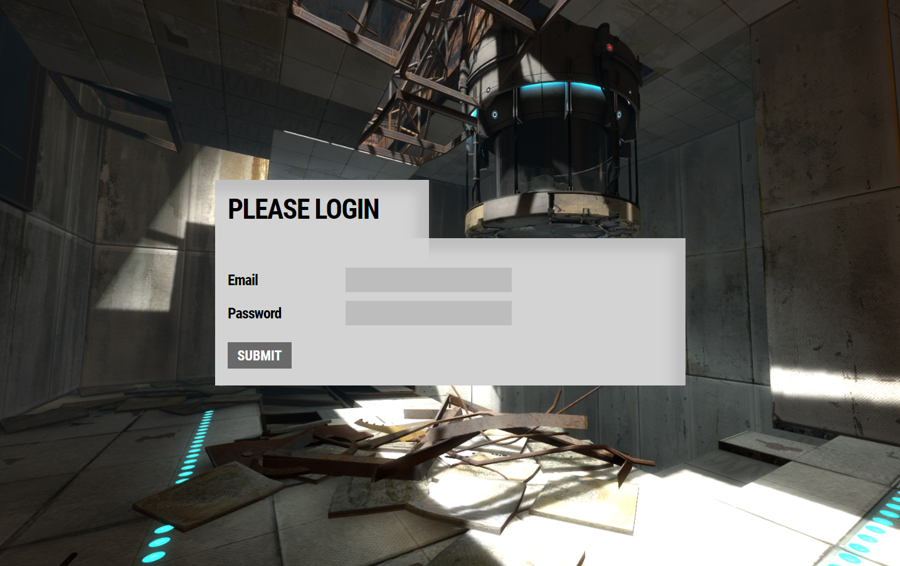

# Software Engineer Candidate technical challenge

As part of the recruitment process at intelliHR, we ask that complete this code challenge.  We will review your submission and then conduct a code review in a formal interview setting.

In this repository you will find a simple application that produces a React UI which communicates via GraphQL to a Laravel service and Postgres database.  The application will serve two pages, a login page and a subjects list.  The application stack also includes unit and e2e tests.

For this challenge, you will require docker and docker-compose available in your working environment.  This application also makes use of the docker-provided internal hostname.

---

## Launching development environment



Fork this repository and clone it into your working environment of choice.

Once available, run the following commands from the root directory:
1. ``` docker-compose up -d --build ```
2. ``` docker exec laravel php artisan migrate ```
3. ``` docker exec laravel php artisan db:seed --class=DatabaseSeeder ```
4. ``` docker exec laravel php artisan db:seed --class=SubjectSeeder ```

From the nextjs directory, run:
&nbsp;&nbsp;&nbsp;5. ``` yarn install ```

Finally, launch the application with:
&nbsp;&nbsp;&nbsp;6. ``` docker-compose up ```

You may now find the nextjs application served at localhost:3000 / host.docker.internal:3000.  You may also access the laravel application at port 80 (though this will just return a Hello World).

The seeding steps above will create the following user:
**Email:** GLaDOS@aperture.com 
**Password:** ISawDeer



### Testing
You will notice a cypress container deploying and executing e2e tests in the step above.  You can re-run that process by
- ``` docker-compose up cypress ```

There are also unit tests available:
- ``` docker exec laravel php artisan test ```
- ``` docker exec nextjs yarn test ```

Once you have the application stack running, you're ready to take on the challenges below!

---

## Challenge

### Aperture Science Enrichment Centre requires a new management system to conduct exciting new tests! Tests are questionnaires completed by (willing) human subjects, how exciting!

*Testing is the future, and the future starts with you.*

## Software Engineer

Please complete the following user stories relative to the role you are applying for.  You may optionally complete user stories from other role levels.

**Graduate Software Engineer:**
1. As an un-authenticated user, I should *not* be able to request a subject list from the API.
2. As an authenticated user, I want to be able to sort testing subjects by age and testing chamber from within the interface.
3. As an authenticated user, I want to be able to sort testing subjects by age and testing chamber in my API requests.

**Software Engineer I:** 
1. As an authenticated user, I want to be able to create testing subject records.
2. As an authenticated user, I want to be able to edit testing subject records.

**Software Engineer II:**
1. As an authenticated user, I want to be able to create testing subject records.
2. As an authenticated user, I want to be able to edit testing subject records.
3. As an authenticated user, I want to be able to paginate through subject records in the interface.

**Senior Software Engineer:**
1. As an authenticated user, I want to be able to create testing subject records.
2. As an authenticated user, I want to be able to edit testing subject records.
3. As a testing subject, I want to be able to log into the system, but I should only be able to see/edit my own subject data.
4. As a testing subject, I want to be able to reset my password.


## Submissions

Please submit your response as a link to a forked repo (we will share accounts to invite if you wish to keep it private).

*Note:* Testing and documentation are vital for software professionals, please keep that in mind when finishing your submission.
